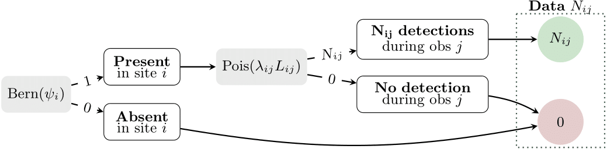

```{r setup, include=FALSE}
knitr::opts_chunk$set(
  echo = TRUE, # show code of the chunk and chunk output
  error = TRUE,
  collapse = FALSE,
  comment = "", # no comment character for the chunk text outputs
  out.width = "100%" # responsive width for chunk outputs (figures, ...)
)
```

```{r library, echo=T, results="hide"}
# While it is not packaged
setwd("~/synchros_git/MOBICO_git/unmarked/")
knitr::opts_knit$set(root.dir = "~/synchros_git/MOBICO_git/unmarked/")
source("./R/occuCOP.R")
library(ggplot2)
library(ggrepel)
library(dplyr)
library(tibble)
library(tidyr)
```


# How does `occuCOP` work?

> Hereafter, I use the notation defined in the following table.
> 
|       Notation | Parameter                                                    |
| -------------: | :----------------------------------------------------------- |
|            $M$ | Number of sites                                              |
|            $J$ | Number of observations                                       |
|       $\psi_i$ | Occupancy probability in site $i$                            |
|          $Z_i$ | Occupancy state of site $i$ (present = 1, absent = 0)        |
| $\lambda_{ij}$ | Detection rate in site $i$ during observation $j$            |
|       $T_{ij}$ | Duration or length of observation $j$                        |
|       $N_{i}$  | Number of detections in site $i$                             |
|       $N_{ij}$ | Number of detections in site $i$ during observation $j$      |
> 
> Table: Mathematical notation

## The COP occupancy model

COP stands for "Counting Occurrences Process". It is an occupancy model, hence it is a hierarchical model with two submodels : the **ecological submodel**, for occupancy; and the **observation submodel**, to take into account imperfect detection. Two equations therefore define this model.

- The **ecological submodel** for occupancy, with:
  - $Z_i$ the occupancy state of site $i$, with $Z_i=1$ if the species is present in site $i$ and $Z_i=0$ if the species is absent.
  - $\psi_i$ the occupancy probability, whose value depends on the site covariates of site $i$.
- The **observation submodel** for imperfect detection, with:
  - $N_{ij}$ the number of detection events in site $i$ during observation $j$
  - $\lambda_{ij}$ the detection rate per time-unit or space-unit in site $i$ during observation $j$
  - $L_{ij}$ the length of the $j^{th}$ observation in site $i$

$$
Z_i \sim \text{Bernoulli}(\psi_{i}) \\
N_{ij} \sim \text{Poisson}(\lambda_{ij} L_{ij})
$$

The full process can be schematised, as in the following figure. This figure helps understanding what we mean by imperfect detection in occupancy modelling: a site can be occupied by a species and remain undetected.

```{r cop-model, echo=FALSE, out.width="90%", fig.cap="COP occupancy model (from @pautrel2023)", fig.align = 'center'}

```

What we call **observation** ($j$) can correspond to several ways to collect data, for example:

- **Sampling occasions**: field operators collect data several times. They monitor the site during a given amount of time at each sampling occasion. Sampling occasions are seperated by periods of time during when the site is not monitored. $L_{ij}$ is the duration of the $j^{th}$ sampling occasion in site $i$ and $\lambda_{ij}$ can typically be the rate of detection events per day or per hour.
- **Transects**: field operators follow a straight path that cuts through a landscape and note their observations. Operators can cover each transect in a study several times and/or there can be several transects per site. $L_{ij}$ is the length of the $j^th$ transect in site $i$ and $\lambda_{ij}$ can typically be the rate of detection events per kilometer.
- **Sessions**: data is collected continuously for a long period of time, through sensors (camera-traps, automatic recording units) or opportunistically. Data is discretised -- or aggregated -- for periods of time called sessions that occur consecutively, without any gaps between them. $L_{ij}$ is the duration of the $j^{th}$ session in site $i$ and $\lambda_{ij}$ can typically be the rate of detection events per day or per hour.

## Fitting the model by maximum likelihood estimation

The model is fitted by maximum likelihood estimation (MLE). Likelihood is the probability of observing the data we have given a set of parameters.

Here, likelihood for site $i$ is the probability of observing $N_i = \sum_{j=1}^{J} N_{ij}$ the count of all detection events in site $i$, with $L_{i} = \sum_{j=1}^{J} L_{ij}$ the total observation length in site $i$, given parameters $\psi_{i}$ the occupancy probability and $\lambda_{ij}$ the detection rate. 

The likelihood ($\mathcal{L}$) of this model is described hereafter, and is detailed in supplementary materials of @pautrel2023.

\begin{align}
\begin{split}
  \mathcal{L}(\psi_i, \lambda_{is})
    &= \prod_{i=1}^{M} \mathbb{P}_{\psi_i, \lambda_{is}}(N_{i} = n_{i}) \\
    &=  
        \prod_{i, n_i > 0} \left ( \mathbb{P}_{\psi_i, \lambda_{is}}(N_{i} = n_i, n_i > 0) \right )
        \times 
        \prod_{i, n_i = 0} \left ( \mathbb{P}_{\psi_i, \lambda_{is}}(N_{i} = 0) \right ) \\
    &= 
        \prod_{i, n_i > 0} \left ( 
            \psi_i \frac{ \left( \sum_{s=1}^S(\lambda_{is} L_{is}) \right) ^ {n_i} }{ n_{i}! } e^{-\sum_{s=1}^S(\lambda_{is} L_{is})}
        \right )
        \times 
        \prod_{i, n_i = 0} \left (
            \psi_i e^{-\sum_{s=1}^S(\lambda_{is} L_{is})}  + (1-\psi_i)
        \right )
\end{split}
\end{align}

To maximise the likelihood, we use an optimisation algorithm. We actually minimise the log-likelihood ($log(\mathcal{L})$) for computational reasons. In R, optimisation algorithms are embedded in the `optim` function. We can visualise  how can the likelihood vary depending on the parameters, to better understand what the optimisation algorithm does. 

With the COP model, here are examples of log-likelihood for varying simulation scenarios (see simul_lambda on top, simul_psi on the right), and for different values of $\psi$ (on the bottom) and $\lambda$ (line colours, the thick lines corresponding to the detection rate $\lambda$ used to simulate data). The black dotted lines and labels correspond to the value of the parameters $\psi$ and $\lambda$ for the maximum likelihood estimated by the optimisation algorithm.

```{r how-is-the-model-fitted, echo=FALSE, fig.height=10, fig.width=12, message=FALSE}
M = 100 # Number of sites
J = 5 # Number of observations (transects, sessions, sampling occasions...)
cpt = 1
for (simul_psi in c(.1, .25, .5, .75, .9)) {
  for (simul_lambda in c(1, 3, 5)) {
    simul_z = sample(
      x = c(0, 1),
      size = M,
      replace = T,
      prob = c(1 - simul_psi, simul_psi)
    )
    simul_y <- matrix(rpois(n = M * J, lambda = simul_lambda),
                      nrow = M,
                      ncol = J) * simul_z
    
    fit = occuCOP(data = unmarkedFrameCOP(y = simul_y,
                                          L = (simul_y * 0 + 1)),
                  psistarts=0, lambdastarts=0)
    estim_psi = backTransform(fit, "psi")
    estim_lambda = backTransform(fit, "lambda")
    
    nll_df_plot_i = occuCOP(
      data = unmarkedFrameCOP(y = simul_y, L = (simul_y * 0 + 1)),
      get.NLL.params =
        as.list(as.data.frame(t(
          expand.grid("psi" = qlogis(seq(0.01, 0.99, by = 0.02)),
                      # "lambda" = log(round(
                      #   simul_lambda * seq(from = 0.25, to = 1.75, by = .25), 2
                      # ))
                      lambda=log(c(1,3,5))
                      )
        )))
    )
    nll_df_plot_i$simul_psi = simul_psi
    nll_df_plot_i$simul_lambda = simul_lambda
    nll_df_plot_i$estim_psi = estim_psi@estimate
    nll_df_plot_i$estim_lambda = estim_lambda@estimate
    
    if (cpt == 1) {
      nll_df_plot = nll_df_plot_i
    } else{
      nll_df_plot = rbind(nll_df_plot, nll_df_plot_i)
    }
    # cat('\r',cpt,"/ 15")
    cpt = cpt + 1
    rm(nll_df_plot_i)
  }
}

nll_df_plot$psi = plogis(nll_df_plot[, "logit(psi).(Intercept)"])
nll_df_plot$lambda = exp(nll_df_plot[, "log(lambda).(Intercept)"])
nll_df_plot$simulated_lambda = (round(nll_df_plot$lambda, 2) == round(nll_df_plot$simul_lambda, 2))
nll_df_plot$lambda_txt = format(nll_df_plot$lambda, digits = 2, nsmall = 2)
nll_df_plot$label = ifelse(nll_df_plot$psi == max(nll_df_plot$psi),
                           paste0("λ=", nll_df_plot$lambda_txt),
                           NA)

df_estimates = nll_df_plot %>%
  group_by(simul_psi, simul_lambda) %>%
  summarise(
    estim_psi = unique(estim_psi),
    estim_lambda = unique(estim_lambda),
    maximum_llh = max(-nll),
    minimum_llh = min(-nll),
    .groups = "drop"
  )

ggplot() +
  geom_line(
    data = nll_df_plot,
    aes(
      x = psi,
      y = -nll,
      colour = lambda_txt,
      linewidth = simulated_lambda
    )
  ) +
  ggh4x::facet_grid2(
    simul_psi ~ simul_lambda,
    labeller = label_both,
    scales = "free_y",
    independent = "y"
  ) +
  labs(
    title = "Negative log-likelihood of the COP model for different values of ψ and λ",
    x = "ψ",
    y = "Log-likelihood",
    colour = "λ"
  ) +
  scale_linewidth_manual(values = c("TRUE" = 2, "FALSE" = 1)) +
  theme_light()+
  geom_vline(data = df_estimates,
             aes(xintercept = estim_psi),
             linetype = "dotted") +
  geom_label(data = df_estimates, aes(
    x = estim_psi,
    y = minimum_llh + abs(minimum_llh * .1),
    label = paste0("λ: ", round(estim_lambda, 2))
  )) +
  geom_hline(data = df_estimates,
             aes(yintercept = maximum_llh),
             linetype = "dotted") +
  geom_label(data = df_estimates, aes(
    x = 0,
    y = maximum_llh - 30,
    label = paste0("ψ: ", round(estim_psi, 2))
  )) +
  xlim(-.1, 1) +
  theme(legend.position = "bottom") +
  guides(linewidth = "none")

```

# Simulating a data set

```{r init}
set.seed(0)

M = 100 # Number of sites
J = 5 # Number of observations (transects, sessions, sampling occasions...)
```

We first simulate the data set. We'll simulate data in M = `r M` sites during J = `r J` sampling occasions.

We simulate site covariates:

- "elev" will not be used to impact the occupancy probability
- "habitat" will be used

```{r simul-psi-cov}
SiteCov <- data.frame(
  "elev" = pmax(rnorm(n = M, mean = 50, sd = 50), 0),
  "habitat" = factor(sample(
    x = c("A", "B", "C"),
    size = M,
    replace = T
  ))
)
print(as_tibble(SiteCov))
```


We simulate the occupancy state of all sites depending on the habitat type.

```{r simul-psi-z}
# Occupancy probability depending on habitat type
simul_psi_habA = 0.9
simul_psi_habB = 0.5
simul_psi_habC = 0.1

simul_psi = ifelse(
  SiteCov$habitat == "A",
  simul_psi_habA,
  ifelse(SiteCov$habitat == "B", simul_psi_habB, simul_psi_habC)
)

# For each site, we simulate occupancy state
z_i = rep(NA, M)
for (i in 1:M) {
  z_i[i] <- sample(c(0, 1), size = 1, prob = c(1 - simul_psi[i], simul_psi[i]))
}

# We have this data:
print(as_tibble(data.frame("habitat" = SiteCov$habitat, "z" = z_i)))

# In our data, our occupancy probability per habitat is slightly different 
# from the one we chose to simulate due to randomness:
print(
  data.frame("habitat" = SiteCov$habitat, "z" = z_i) %>% 
    group_by(habitat) %>% 
    summarise("NbSites" = n(), "psi" = mean(z))
)
```

There are `r sum(z_i)` occupied sites out of `r M` in our simulation.

We simulate temporal covariates:

- "wind" will not impact the detection rate
- "rain" will impact the detection rate

```{r simul-lambda-cov}
# Temporal covariates
TemporalCov <- list(
  "rain" = matrix(pmax(rexp(n = M * J, rate = 1 / 10), 0), nrow = M, ncol = J),
  "wind" = matrix(rnorm(n = M * J, mean = 10), nrow = M, ncol = J)
)
print(as_tibble(TemporalCov))
```

We then simulate the detection rate depending on "rain" as a linear 

```{r simul-lambda}
lambda_from_rain = function(rain) {
  # pmin(pmax((3 - .2 * rain), 0), 2)
  2 / (1 + exp(.2 * (rain - 20)))
}
rain_lambda = data.frame("rain" = seq(0, max(TemporalCov$rain), by = c(.1)))
rain_lambda$lambda = lambda_from_rain(rain_lambda$rain)
plot(x = rain_lambda$rain,
     y = rain_lambda$lambda,
     type = "l")

simul_lambda = lambda_from_rain(TemporalCov$rain)
```

Finally, for each site, we simulate a number of detections based on the occupancy state $z_i$ of site $i$ and detection rate $lambda_{ij}$ of site $i$ observation $j$.

```{r simul-y}
y = matrix(
  rpois(n = M * J, lambda = as.numeric(t(simul_lambda))),
  nrow = M,
  ncol = J,
  byrow = T
) * z_i

data.frame(
  "simul_lambda" = as.numeric(t(simul_lambda)),
  "y" = as.numeric(t(y)),
  "z" = rep(z_i, each = J)
) %>%
  ggplot(aes(x = simul_lambda, y = y)) +
  geom_point(alpha=.3,shape=16,size=2) +
  facet_grid(z ~ .,labeller = label_both) +
  theme_light()
```

Let's say that each observation lasts one time-unit here, *e.g.* one day per sampling occasion.

```{r simul-L}
L = y * 0 + 1
class(L)
print(as_tibble(L))
```

# Creating an `unmarkedFrameCOP` object

Now that we have data, we create our unmarkedFrameCOP object.

```{r umf-creation}
umf = unmarkedFrameCOP(
  y = y,
  L = L,
  siteCovs = SiteCov,
  obsCovs = TemporalCov
)
```

We can visualise what is in this `unmarkedFrameCOP` object with several functions.

```{r umf-visu}
head(umf)

summary(umf)

# You can subset an unmarkedFrame: here the 2nd site, 4th observation
print(umf[2, 4])

plot(umf)
```

## Warning and errors {.unnumbered}

There is an error if there are decimals in y.

```{r umf-error-decimal}
y_with_decimals = y
y_with_decimals[2, 1] = 49.5
unmarkedFrameCOP(
  y = y_with_decimals,
  L = L,
  siteCovs = SiteCov,
  obsCovs = TemporalCov
)
```

There is a warning if data is detection/non-detection (1/0) instead of count.

```{r umf-warning-01}
unmarkedFrameCOP(
  y = ((y > 0) * 1),
  L = L,
  siteCovs = SiteCov,
  obsCovs = TemporalCov
)
```

There is an error if the dimension of L is different than that of y.

```{r umf-error-L}
unmarkedFrameCOP(
  y = y,
  L = L[1:5, 1:2],
  siteCovs = SiteCov,
  obsCovs = TemporalCov
)
```

# Fit the model

## Null model fitting

```{r null-fit}
occuCOP(
  data = umf,
  psiformula = ~ 1,
  lambdaformula = ~ 1,
  method = "Nelder-Mead"
)
```

Note that we a warning because observation lengths (L) were all set to 1 in our unmarkedFrame. This was our aim, so we can add `L1 = TRUE` in the function parameters.

```{r}
occuCOP(
  data = umf,
  psiformula = ~ 1,
  lambdaformula = ~ 1,
  method = "Nelder-Mead",
  L1 = TRUE
)
```

We also have messages to inform us of the default initial parameters for the optimisation algorithm. These messages can be removed by choosing them manually. For example, we could set initial parameters that are close to what we can intuitively expect with our data.

Intuitively, the initial psi value can be the proportion of sites in which we do not have any observations.

```{r}
(psi_init <- mean(rowSums(y) == 0))
```

And the initial lambda value can be the mean count of detection events in sites in which there was at least one observation.

```{r}
(lambda_init <- mean(y[rowSums(y) > 0, ]))
```

We have to transform them. See `?occuCOP` for more information about these transformations.

```{r}
(resCOP_null <- occuCOP(
  data = umf,
  psiformula = ~ 1,
  lambdaformula = ~ 1,
  psistarts = qlogis(psi_init),
  lambdastarts = log(lambda_init),
  method = "Nelder-Mead",
  L1 = TRUE
))
```

## $\psi$ ~ habitat, $\lambda$ ~ rain

With covariates, we need initial values for the optimisation to be vectors of the adequate length. Here, we will keep the default initial values of 0, which backtransformed, correspond to an occupancy probability of 0.5 and a detection rate of 1.

```{r cov-fit}
(resCOP_habitat_rain <- occuCOP(
  data = umf,
  psiformula = ~ -1 + habitat,
  lambdaformula = ~ rain,
  method = "Nelder-Mead",
  L1 = TRUE
))
```

A warning tell us that the model did not converge. We can add in parameters for optim in the `occuCOP` function, for example to increase the maximum number of iterations, with `control = list(maxit = 5000)`:

```{r cov-fit-maxit}
(resCOP_habitat_rain <- occuCOP(
  data = umf,
  psiformula = ~ -1 + habitat,
  lambdaformula = ~ rain,
  method = "Nelder-Mead",
  L1 = TRUE,
  control = list(maxit = 5000)
))
```

## Back-transforming parameter estimates

To check the names of the parameters for the submodels of the COP occupancy model, we can use the function `names`.

```{r param-names}
names(resCOP_null)
```

### For a model without covariates

Without covariates, we can use the function `backTransform`. 

```{r null-backtransform}
# Occcupancy estimate
backTransform(resCOP_null, type = "psi")

# Detection rate estimate
backTransform(resCOP_null, type = "lambda")
```

Alternatively, we can back-transform the parameter manually. Most users should use the `backTransform` function in this situation, but if you need to go in depth, here's how to do it.

```{r null-backtransform-manual}
# Occcupancy probability psi
## What is the inverse link, the function to back-transform the estimate?
resCOP_null@estimates@estimates$psi@invlink
## Manual back-transformation
logistic(coef(resCOP_null, "psi"))
plogis(coef(resCOP_null, "psi")) # plogis(x): "inverse logit", equivalent to logistic(x)

# Detection rate lambda
## What is the inverse link, the function to back-transform the estimate?
resCOP_null@estimates@estimates$lambda@invlink
## Manual back-transformation
exp(coef(resCOP_null, "lambda"))
```


### For a model with covariates

With covariates, we can no longer use the function `backTransform`:

```{r cov-backtransform}
backTransform(resCOP_habitat_rain, type = "psi")
```

Instead, we can use the function `predict`, which can be used to back-transform the parameters depending on the covariates. `predict` can also be used, as its name leads on, to predict occupancy and detection with new parameters, if the user specify `newdata`.

```{r cov-predict}
# Occcupancy estimate
psipred = predict(object = resCOP_habitat_rain, type = "psi", appendData = TRUE)
print(as_tibble(psipred[, c("Predicted", "SE", "lower", "upper", "habitat", "elev")]))

# Detection rate estimate
lambdapred = predict(object = resCOP_habitat_rain, type = "lambda", appendData = FALSE)
print(as_tibble(cbind(
  data.frame(
    "site" = rep(1:M, each = J),
    "observation" = rep(1:J, times = M),
    "rain" = resCOP_habitat_rain@data@obsCovs$rain
  ),
  lambdapred
)))
```

We can also backtransform the parameters manually. This works well for qualitative covariates (*e.g.* habitat), but not for quantitative covariates (*e.g.* rain), because linear regression with the covariate is applied to the **transformed parameters**, and should be back-transformed only afterwards.

```{r cov-backtransform-manual}
# Occupancy estimate
logistic(coef(resCOP_habitat_rain, "psi"))

# Detection rate estimate
exp(coef(resCOP_habitat_rain, "lambda"))

# We're supposed to have a predicted lambda ≈ 1.77 for rain = 6.03, as we can see using predict:
predict(resCOP_habitat_rain,
        type = "lambda",
        newdata = data.frame("rain" = 6.03))

# With the back-transformed parameters, this doesnt work!
1.9693466 + 0.9821017 * 6.03 

# We have to back-transform the results AFTER we applied the linear regression.
exp(0.67770181 - 0.01806041 * 6.03) 
```

## Plot the model fit

```{r}
plot(resCOP_null)
plot(resCOP_habitat_rain)
```


## Model selection

We can compare several models by their AIC by using `fitList` and `modSel`. 

```{r ranking}
fl <- fitList(fits = list(
  # lambda~1
  "psi~1              lambda~1" = suppressWarnings(suppressMessages(occuCOP(
     umf, ~1, ~1
  ))),
  "psi~habitat        lambda~1" = suppressWarnings(suppressMessages(occuCOP(
     umf, ~habitat, ~1
  ))),
  "psi~elev           lambda~1" = suppressWarnings(suppressMessages(occuCOP(
     umf, ~elev, ~1
  ))),
  "psi~habitat+elev   lambda~1" = suppressWarnings(suppressMessages(occuCOP(
     umf, ~habitat+elev, ~1
  ))),
  # lambda~rain
  "psi~1              lambda~rain" = suppressWarnings(suppressMessages(occuCOP(
     umf, ~1, ~rain
  ))),
  "psi~habitat        lambda~rain" = suppressWarnings(suppressMessages(occuCOP(
     umf, ~habitat, ~rain
  ))),
  "psi~elev           lambda~rain" = suppressWarnings(suppressMessages(occuCOP(
     umf, ~elev, ~rain
  ))),
  "psi~habitat+elev   lambda~rain" = suppressWarnings(suppressMessages(occuCOP(
     umf, ~habitat+elev, ~rain
  ))),
  # lambda~wind
  "psi~1              lambda~wind" = suppressWarnings(suppressMessages(occuCOP(
     umf, ~1, ~wind
  ))),
  "psi~habitat        lambda~wind" = suppressWarnings(suppressMessages(occuCOP(
     umf, ~habitat, ~wind
  ))),
  "psi~elev           lambda~wind" = suppressWarnings(suppressMessages(occuCOP(
     umf, ~elev, ~wind
  ))),
  "psi~habitat+elev   lambda~wind" = suppressWarnings(suppressMessages(occuCOP(
     umf, ~habitat+elev, ~wind
  ))),
  # lambda~rain+wind
  "psi~1              lambda~rain+wind" = suppressWarnings(suppressMessages(occuCOP(
     umf, ~1, ~rain+wind
  ))),
  "psi~habitat        lambda~rain+wind" = suppressWarnings(suppressMessages(occuCOP(
     umf, ~habitat, ~rain+wind
  ))),
  "psi~elev           lambda~rain+wind" = suppressWarnings(suppressMessages(occuCOP(
     umf, ~elev, ~rain+wind
  ))),
  "psi~habitat+elev   lambda~rain+wind" = suppressWarnings(suppressMessages(occuCOP(
     umf, ~habitat+elev, ~rain+wind
  )))
))
modSel(fl)
```

Here, we compared all possible models, with the default parameters (optimisation algorithm, initial values, ...). This approach if often applied by model users to select their model. Note that selecting a model only by minimising AIC is very often flawed, as it is in our case. The model with the lower AIC is `psi~habitat, lambda~rain+wind`, where the occupancy probability depends on the habitat type, and the detection rate depends on both rain and wind. However, because we simulated our data above, we know that the best model should have been `psi~habitat, lambda~rain`, since neither the elevation nor the wind were used to simulate the count data.

## How well did the model estimated the simulated parameters?

We know under which conditions we simulated data, because we chose the simulated parameters $\lambda$ and $\psi$. Therefore, we can compare the "true parameters" to the "estimated parameters". Here, we will focus on this one example only.

### $\psi$ the occupancy probability

```{r how-well-did-COP-estimated-psi, class.source = 'fold-hide', out.width = "60%"}
psi_simulVSestim = data.frame(
  "habitat" = SiteCov$habitat,
  "simul" = simul_psi,
  "estim_null" = predict(resCOP_null, "psi", re.form=T)$Predicted,
  "estim_habitat_rain" = predict(resCOP_habitat_rain, "psi", re.form=T)$Predicted
)

tidyr::pivot_longer(
  psi_simulVSestim,
  cols = c("simul","estim_null","estim_habitat_rain"),
  names_to = "model",
  values_to = "estim"
) %>% 
  mutate(model = factor(
    model,
    levels = c("simul", "estim_null", "estim_habitat_rain"),
    labels = c("Simulated", "Null model", "ψ ~ habitat, λ ~ rain"),
    ordered = T
  )) %>% 
  ggplot(aes(x = estim, y = habitat, colour = model)) +
  geom_point() +
  labs(
    title = "How well did the COP model estimate ψ?",
    x = "Occupancy probability (ψ)",
    y = "Habitat",
    colour = "Model"
  ) +
  theme_light() +
  theme(legend.title = element_blank(),
        legend.position = "bottom")
```

### $\lambda$ the detection rate

```{r how-well-did-COP-estimated-lambda, class.source = 'fold-hide', out.width = "60%"}
lambda_simulVSestim = data.frame(
  "rain" = as.numeric(t(TemporalCov$rain)),
  "simul" = as.numeric(t(simul_lambda)),
  "estim_null" = as.numeric(t(predict(resCOP_null, "lambda", re.form=T)$Predicted)),
  "estim_habitat_rain" = as.numeric(t(predict(resCOP_habitat_rain, "lambda", re.form=T)$Predicted))
)

tidyr::pivot_longer(
  lambda_simulVSestim,
  cols = c("simul","estim_null","estim_habitat_rain"),
  names_to = "model",
  values_to = "estim"
) %>%
  mutate(model = factor(
    model,
    levels = c("simul", "estim_null", "estim_habitat_rain"),
    labels = c("Simulated", "Null model", "ψ ~ habitat, λ ~ rain"),
    ordered = T
  )) %>% 
ggplot(aes(x = estim, y = rain, colour = model)) +
  geom_point() +
  labs(
    title = "How well did the COP model estimate λ?",
    x = "Detection rate (λ)",
    y = "Rain",
    colour = "Model"
  ) +
  theme_light() +
  theme(legend.title = element_blank(),
        legend.position = "bottom")

```

# Model diagnostics

## Posterior distributions

$$\mathbb{P}(z_{i} = 1 \vert y_{ij}, \widehat{\psi_{i}}, \widehat{\lambda_{ij}})$$

```{r}
(re_null <- ranef(resCOP_null))
(re_habitat_rain <- ranef(resCOP_habitat_rain))
bup(re_habitat_rain, stat = "mean") # Posterior mean
confint(re_habitat_rain, level = 0.80) # 80% CI
plot(re_habitat_rain)
```


## Simulate data sets

### Based on chosen parameters

> For more information, see https://rbchan.github.io/unmarked/articles/simulate.html.

```{r simul-chosen-params}
simul_umf <- simulate(
  "COP",
  formulas = list(psi =  ~ elev + habitat, lambda =  ~ rain),
  coefs = list(
    psi = c(
      intercept = qlogis(.2),
      elev = -0.5,
      habitatB = .5,
      habitatC = .8
    ),
    lambda = c(intercept = log(3), rain = -1)
  ),
  design = list(M = 100, J = 3),
  guide = list(
    elev = list(dist = rnorm, mean = 100, sd = 80),
    habitat = factor(levels = c("A", "B", "C"))
  ),
  seed = 123
)
head(simul_umf)
summary(simul_umf)
```

### Based on a unmarkedFitCOP object

We can also generate new simulated count data (y) with our estimated parameters and our covariates.

```{r}
y_simulate = simulate(resCOP_habitat_rain, nsim = 5)
str(y_simulate)
```

## Bootstrap

### Parametric bootstrap with `parboot`

```{r}
parboot(resCOP_null, statistics = unmarked::SSE, nsim = 20)
```


### Non-parametric bootstrap

Not currently supported.

```{r}
nonparboot(resCOP_null)
```


# References
