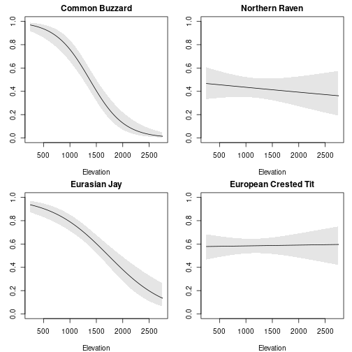
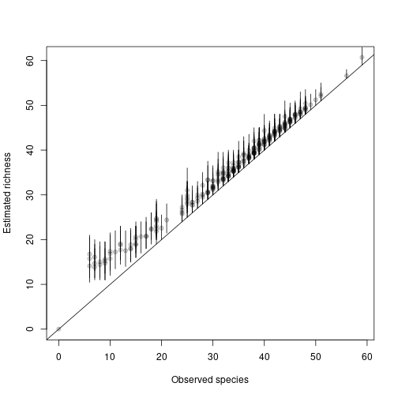
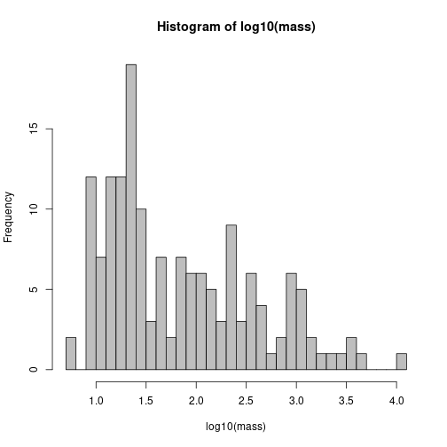
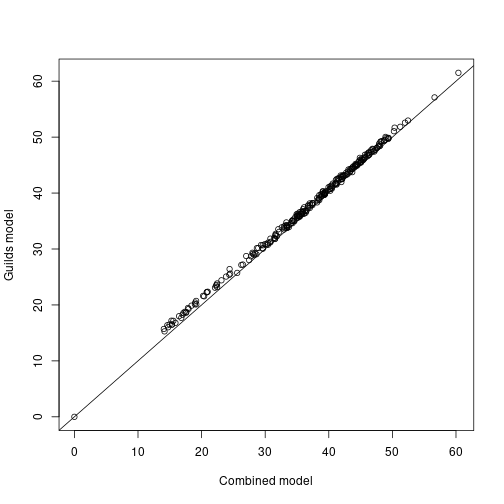

# Introduction

In a community occupancy model, detection-nondetection data from multiple species are analyzed together.
Intercepts and slopes in the model are species-specific and come from common distributions, allowing for information sharing across species.
This structure also allows estimation of site richness.
For example, suppose you have sites indexed $i$, occasions $j$ and species $s$.
The true occupancy state at a site is

$$z_{is} \sim \mathrm{Bernoulli}(\psi_{is})$$

with detection data $y_{ijs}$ modeled as

$$y_{ijs} \sim \mathrm{Bernoulli}(p_{ijs} \cdot z_{is}) $$

Occupancy probability $\psi_{is}$ can be modeled as a function of covariates with species-specific random intercepts and slopes coming from common distributions:

$$\psi_{is} = \mathrm{logit}(\beta_{0,s} + \beta_{i,s} \cdot x_i) $$

$$ \beta_{0,s} \sim \mathrm{Normal}(\mu_{\beta_0}, \sigma_{\beta_0}) $$

$$ \beta_{1,s} \sim \mathrm{Normal}(\mu_{\beta_1}, \sigma_{\beta_1}) $$

A similar structure can be implemented for detection probability $p$.

Note there is a variety of this model that incorporates hypothetical completely unobserved species using data augmentation, but that is not a model that `unmarked` is able to fit at this time.

# Example dataset

We'll use an avian point count dataset from the Swiss breeding bird survey (MHB) in 2014.
The data are counts of 158 species at 267 sites. 
The dataset is included in the `AHMbook` package.
For more detailed analyses of this dataset, see [Applied Hiearchical Modeling in Ecology](https://www.sciencedirect.com/book/9780128013786/applied-hierarchical-modeling-in-ecology), Volume 1, section 11.6.
You can also check `?MHB2014` for more information.


``` r
library(AHMbook)
data(MHB2014)
names(MHB2014)
```

```
## [1] "species" "sites"   "counts"  "date"    "dur"
```

Included in this dataset:

1. `species`: Species-level information and covariates
2. `sites`: Site covariates
3. `counts`: Counts by site and species
4. `date`: Sampling dates (site by occasion)
5. `dur`: Sampling duration (site by occasion) 

# Organize the dataset

## Detection-nondetection data

We'll start by converting the count data to detection-nondetection data (`y`).
The counts are provided in an array format.
For use with `occuComm`, the `y` array should have dimensions site (M) x occasion (J) x species (S).
You can also specify `y` as a list with length equal to S, with each list element a matrix with dimensions M x J (similar to `occuMulti`).
We'll keep things as an array.


``` r
y <- MHB2014$counts
dim(y)
```

```
## [1] 267   3 158
```

``` r
y[y > 0] <- 1
```

## Species covariates

The model allows for species-level covariates.
The covariates must be provided as a named list.
Each list element is a separate covariate and can have one of three dimensions: either a vector of length S, a matrix M x S, or an array M x J x S depending on how the covariate varies.
For example, you could provide the mean body weight of the species as a vector of length S, or the density of the preferred prey of the species at each site (which could differ by species) as a matrix M x S.
In the MHB data, all the species covariates are body size measurements and thus are vectors of length S.


``` r
spcov <- as.list(MHB2014$species[,c("body.length", "body.mass", "wing.span")])
str(spcov)
```

```
## List of 3
##  $ body.length: int [1:158] 27 48 90 35 102 150 80 58 62 55 ...
##  $ body.mass  : int [1:158] 150 1000 1800 150 3250 11000 3300 1100 1300 1350 ...
##  $ wing.span  : int [1:158] 43 87 165 55 200 220 165 89 91 130 ...
```

## Site covariates

These are organized as usual for `unmarked` models and are contained in `MHB2014$sites`.


``` r
sitecov <- MHB2014$site[c("elev", "rlength", "forest")]
head(sitecov)
```

```
##   elev rlength forest
## 1  450     6.4      3
## 2  450     5.5     21
## 3 1050     4.3     32
## 4  950     4.5      9
## 5 1150     5.4     35
## 6  550     3.6      2
```

## Observation covariates

Again these are organized as usual for `unmarked` (as a named list).


``` r
obscov <- MHB2014[c("date", "dur")]
lapply(obscov, head)
```

```
## $date
##      date141 date142 date143
## Q001      21      52      70
## Q002      26      47      59
## Q003      25      52      73
## Q004      40      55      65
## Q005      16      38      62
## Q006      52      61      69
## 
## $dur
##      dur141 dur142 dur143
## Q001    215    220    240
## Q002    195    175    185
## Q003    210    270    210
## Q004    310    300    285
## Q005    240    240    210
## Q006    180    145    140
```

## Create `unmarkedFrame`

The `unmarkedFrame` type for this model is called `unmarkedFrameOccuComm`.
Note the `speciesCovs` argument which is unique to this `unmarkedFrame` type.


``` r
library(unmarked)
umf <- unmarkedFrameOccuComm(y = y, siteCovs = sitecov,
                             obsCovs = obscov, speciesCovs = spcov)
head(umf)
```

```
## Data frame representation of unmarkedFrame object.
## Only showing observation matrix for species 1.
##      y.1 y.2 y.3 elev rlength forest date.1 date.2 date.3 dur.1 dur.2 dur.3
## Q001   0   0   0  450     6.4      3     21     52     70   215   220   240
## Q002   0   0   0  450     5.5     21     26     47     59   195   175   185
## Q003   0   0   0 1050     4.3     32     25     52     73   210   270   210
## Q004   0   0   0  950     4.5      9     40     55     65   310   300   285
## Q005   0   0   0 1150     5.4     35     16     38     62   240   240   210
## Q006   0   0   0  550     3.6      2     52     61     69   180   145   140
## Q007   0   0   0  750     3.9      6     18     40     60   180   195   180
## Q008   0   0   0  650     6.1     60     17     39     61   195   225   210
## Q009   0   0   0  550     5.8      5     18     45     59   190   180   205
## Q010   0   0   0  550     4.5     13     25     50     76   195   203   215
```

# Fit a model

With the dataset organized we can now fit a model with `occuComm`.
We'll specify a model with an effect of elevation (site-level) and body mass (species-level) on occupancy, and no covariates on detection.
The `occuComm` function automatically sets up the species-level random effects for intercepts and slopes.
Note however that there will be no random slope by species for species-level covariates of length S (as this would not make sense).
We can specify the model formulas exactly the same as with the single-species `occu` function.
This model takes a while to fit given the large number of species.


``` r
fit <- occuComm(~1 ~scale(elev) + scale(body.mass),
                data = umf)
```

```
## Warning: 158 sites have been discarded because of missing data.
```

``` r
fit
```

```
## 
## Call:
## occuComm(formula = ~1 ~ scale(elev) + scale(body.mass), data = umf)
## 
## Occupancy (logit-scale):
## Random effects:
##   Groups        Name Variance Std.Dev.
##  species (Intercept)    9.245    3.041
##  species scale(elev)    3.169    1.780
## 
## Fixed effects:
##                  Estimate    SE      z  P(>|z|)
## (Intercept)        -2.980 0.258 -11.57 5.61e-31
## scale(elev)        -0.717 0.155  -4.63 3.64e-06
## scale(body.mass)   -0.769 0.272  -2.83 4.72e-03
## 
## Detection (logit-scale):
## Random effects:
##   Groups        Name Variance Std.Dev.
##  species (Intercept)    1.663    1.289
## 
## Fixed effects:
##  Estimate    SE    z  P(>|z|)
##     0.633 0.122 5.19 2.15e-07
## 
## AIC: 46368.93 
## Number of species: 158
## Number of sites: 266
## ID of sites removed due to NA: 30
```

We get estimates of the overall (mean) intercepts and slopes.
We also get estimates of the random effects SDs for the intercepts and for the elevation slopes (but not for body mass, as noted above).

There is some missing data in the model which generates a warning.
You can ignore the exact number of missing sites reported by the warning - in fact there is only one missing site (#30) which is reported correctly in the summary.

## Estimates of random intercepts and slopes

We can get estimates of the random intercept and slope terms with `randomTerms`.


``` r
rand_est <- randomTerms(fit)
head(rand_est)
```

```
##   Model  Groups        Name               Level  Estimate       SE     lower
## 1   psi species (Intercept)        Little Grebe -2.659992 1.106212 -4.828127
## 2   psi species (Intercept) Great Crested Grebe -2.359038 1.241233 -4.791811
## 3   psi species (Intercept)          Grey Heron -1.517640 1.168330 -3.807526
## 4   psi species (Intercept)      Little Bittern -3.668043 1.461535 -6.532599
## 5   psi species (Intercept)         White Stork -1.106583 1.439474 -3.927901
## 6   psi species (Intercept)           Mute Swan  2.836215 2.545419 -2.152715
##         upper
## 1 -0.49185740
## 2  0.07373509
## 3  0.77224458
## 4 -0.80348815
## 5  1.71473497
## 6  7.82514579
```

``` r
tail(rand_est)
```

```
##     Model  Groups        Name               Level    Estimate        SE
## 469     p species (Intercept)        Corn Bunting -1.04598590 1.0409023
## 470     p species (Intercept)        Yellowhammer  1.49688629 0.2277654
## 471     p species (Intercept)        Cirl Bunting -0.71401947 0.5916209
## 472     p species (Intercept)     Ortolan Bunting -0.07100565 1.3653792
## 473     p species (Intercept)        Rock Bunting  0.40225149 0.2812063
## 474     p species (Intercept) Common Reed Bunting -0.44832431 0.6252049
##          lower     upper
## 469 -3.0861169 0.9941451
## 470  1.0504743 1.9432983
## 471 -1.8735751 0.4455361
## 472 -2.7470997 2.6050885
## 473 -0.1489027 0.9534057
## 474 -1.6737033 0.7770547
```

The estimates provided by this function are mean-0 (i.e., they come from a normal distribution with mean 0).
Thus to get the complete intercept and slope for each species, we need to add the "fixed" part of the intercept and slope (shown in the `Fixed effects` section of the summary, or with `coef()`) to the random part shown above.
We can do this with an argument:


``` r
rand_est <- randomTerms(fit, addMean = TRUE)
head(rand_est)
```

```
##   Model  Groups        Name               Level   Estimate       SE     lower
## 1   psi species (Intercept)        Little Grebe -5.6402732 1.088450 -7.773597
## 2   psi species (Intercept) Great Crested Grebe -5.3393185 1.226390 -7.742998
## 3   psi species (Intercept)          Grey Heron -4.4979213 1.147969 -6.747900
## 4   psi species (Intercept)      Little Bittern -6.6483243 1.452614 -9.495396
## 5   psi species (Intercept)         White Stork -4.0868639 1.422657 -6.875221
## 6   psi species (Intercept)           Mute Swan -0.1440654 2.533089 -5.108828
##       upper
## 1 -3.506950
## 2 -2.935639
## 3 -2.247943
## 4 -3.801252
## 5 -1.298507
## 6  4.820697
```

## Get estimates of occupancy

As usual with `unmarked`, we can use `predict`.
The `predict` function will return estimates of occupancy for each site and species by default.


``` r
pr <- predict(fit, type='state')
lapply(pr[1:3], head)
```

```
## $`Little Grebe`
##     Predicted          SE       lower      upper
## 1 0.062629441 0.027968118 0.025591420 0.14527977
## 2 0.062629441 0.027968118 0.025591420 0.14527977
## 3 0.006932087 0.006147293 0.001211306 0.03862620
## 4 0.010069015 0.007592241 0.002280547 0.04330204
## 5 0.004767739 0.004893379 0.000634300 0.03489633
## 6 0.043842917 0.018741413 0.018733213 0.09920657
## 
## $`Great Crested Grebe`
##     Predicted          SE        lower      upper
## 1 0.040469236 0.023611754 0.0126461928 0.12194572
## 2 0.040469236 0.023611754 0.0126461928 0.12194572
## 3 0.004956348 0.004995188 0.0006837188 0.03499409
## 4 0.007061007 0.006133672 0.0012785527 0.03800045
## 5 0.003476823 0.004020987 0.0003586577 0.03281439
## 6 0.028694428 0.015960275 0.0095246153 0.08320543
## 
## $`Grey Heron`
##     Predicted          SE        lower      upper
## 1 0.047915787 0.024412407 0.0173265386 0.12560618
## 2 0.047915787 0.024412407 0.0173265386 0.12560618
## 3 0.006356595 0.005769278 0.0010666779 0.03691114
## 4 0.008941182 0.006947514 0.0019367894 0.04025524
## 5 0.004515718 0.004725964 0.0005775214 0.03438506
## 6 0.034456683 0.016614842 0.0132319646 0.08673438
```

## Plot covariate relationships by species

We'll plot estimated occupancy by elevation for four species: Common Buzzard, Northern Raven, Eurasian Jay, and European Crested Tit.
We also need to get the corresponding body mass of each species.


``` r
sp <- c("Common Buzzard", "Northern Raven", "Eurasian Jay", "European Crested Tit")
body_mass <- MHB2014$species$body.mass
names(body_mass) <- MHB2014$species$engname
body_mass <- unname(body_mass[sp])
```

First create a sequence of elevation values.


``` r
elev_seq <- seq(min(sitecov$elev), max(sitecov$elev), length.out=100)
```

For each species we create a `newdata` data frame with elevation and the species name and matching body mass.
Then we use `predict`, and plot the results.


``` r
par(mfrow=c(2,2), mar=c(4,3,2,1))
for (i in 1:length(sp)){
  nd <- data.frame(elev=elev_seq,
                   species = sp[i],
                   body.mass = body_mass[i])
  pr <- predict(fit, 'state', newdata=nd)
  plot(elev_seq, pr$Predicted, type='l', xlab="Elevation", ylab="Occupancy",
       main = sp[i], ylim=c(0,1))
  polygon(c(elev_seq, rev(elev_seq)), c(pr$lower, rev(pr$upper)), col='grey90', border=NA)
  lines(elev_seq, pr$Predicted)
}
```



``` r
par(mfrow=c(1,1))
```

## Richness

There's a built-in function for calculating richness at each site from the model.


``` r
rich <- richness(fit)
head(rich)
```

```
## [1] 33.41 34.74 52.46 42.03 45.56 43.37
```

To get the uncertainty of this estimate, we can return a complete posterior and calculate CIs:


``` r
post <- richness(fit, posterior=TRUE)
est <- apply(post@samples, 1, mean)
low <- apply(post@samples, 1, quantile, 0.025)
up <- apply(post@samples, 1, quantile, 0.975)
```

And compare them to naive richness:


``` r
rich_naive <- MHB2014$counts
rich_naive[rich_naive > 0] <- 1
rich_naive <- apply(rich_naive, c(1,3), 
                    function(x) if(all(is.na(x))) return(NA) else return(max(x, na.rm=TRUE))) 
rich_naive <- apply(rich_naive, 1, sum, na.rm=TRUE)

plot(rich_naive, est, xlab="Observed species", ylab="Estimated richness", 
     pch=19, col=rgb(0,0,0,alpha=0.2))
segments(rich_naive, low, rich_naive, up)
abline(a=0, b=1)
```



This figure should look similar to Figure 11.8 in the AHM 1 book (it's not quite the same model).

# Handling guilds or similar groups

In community occupancy models it is common to specify an additional hierarchical structure above species, e.g. guild.
In this version of the model, rather than the random intercepts and slopes coming from common distributions across *all* species, instead information is shared only among species belonging to the same guild.
The model structure is the same as above except the random effect hyperparameters are guild-specific where each species $s$ belongs to one guild $g$.

$$\psi_{is(g)} = \mathrm{logit}(\beta_{0,s(g)} + \beta_{i,s(g)} \cdot x_i) $$

$$ \beta_{0,s(g)} \sim \mathrm{Normal}(\mu_{\beta_{0,g}}, \sigma_{\beta_{0,g}}) $$

$$ \beta_{1,s(g)} \sim \mathrm{Normal}(\mu_{\beta_{1,g}}, \sigma_{\beta_{1,g}}) $$

For example, see the analysis in section 11.6.3 of AHM 1.

The `occuComm` function cannot directly handle this extra hierarchical layer as you can in say, JAGS or NIMBLE.
However, we can get pretty close.
Note that often when we fit a guild-based model like this, we are in effect fitting entirely separate models for each guild.
That is, since no information is being shared among guilds (only within them) we can simply separate the data by guild and fit separate models to each piece and get the same result.
We can then combine the results to get richness, if needed.
This `occuComm` is able to do.

## Dividing the data by guild

We'll divide the species into three "guilds" based on body mass.
This code is identical to the code in AHM 1, section 11.6.3.


``` r
# Look at distribution of body mass among 136 observed species
# Get mean species mass
mass <- MHB2014$species$body.mass 
hist(log10(mass), breaks = 40, col = "grey")
```



``` r
# Look at log10
gmass <- as.numeric(log10(mass) %/% 1.3 + 1)
# Size groups 1, 2 and 3
gmass[gmass == 4] <- 3 # Mute swan is group 3, too
```

## Fit separate models by guild

Now we simply divide our complete dataset into pieces by guild and fit the same model to each dataset separately.


``` r
# Guild 1
spcovs1 <- lapply(spcov, function(x) x[gmass == 1])
umf1 <- unmarkedFrameOccuComm(y = umf@ylist[gmass == 1],
                              siteCovs = sitecov,
                              obsCovs = obscov,
                              speciesCovs = spcovs1)
fit1 <- update(fit, data = umf1)
```

```
## Warning: 45 sites have been discarded because of missing data.
```

``` r
# Guild 2
spcovs2 <- lapply(spcov, function(x) x[gmass == 2])
umf2 <- unmarkedFrameOccuComm(y = umf@ylist[gmass == 2],
                              siteCovs = sitecov,
                              obsCovs = obscov,
                              speciesCovs = spcovs2)
fit2 <- update(fit, data = umf2)
```

```
## Warning: 86 sites have been discarded because of missing data.
```

``` r
# Guild 3
spcovs3 <- lapply(spcov, function(x) x[gmass == 3])
umf3 <- unmarkedFrameOccuComm(y = umf@ylist[gmass == 3],
                              siteCovs = sitecov,
                              obsCovs = obscov,
                              speciesCovs = spcovs3)
fit3 <- update(fit, data = umf3)
```

```
## Warning: 27 sites have been discarded because of missing data.
```

## Calculate richness

To get richness across the entire community, we get posterior samples of richness for each guild and combine them. 


``` r
post1 <- richness(fit1, posterior=TRUE)
post2 <- richness(fit2, posterior=TRUE)
post3 <- richness(fit3, posterior=TRUE)

rich_all <- post1@samples + post2@samples + post3@samples
rich_all <- drop(rich_all)
```

The result is more or less identical to our previous richness estimate using a single model.


``` r
rich_mean <- apply(rich_all, 1, mean)
plot(rich, rich_mean, xlab="Combined model", ylab="Guilds model")
abline(a=0, b=1)
```


