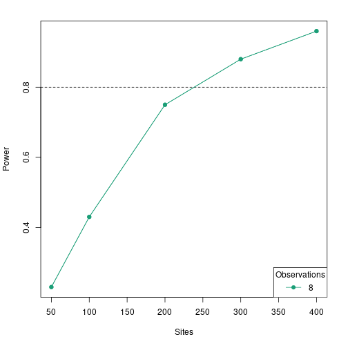
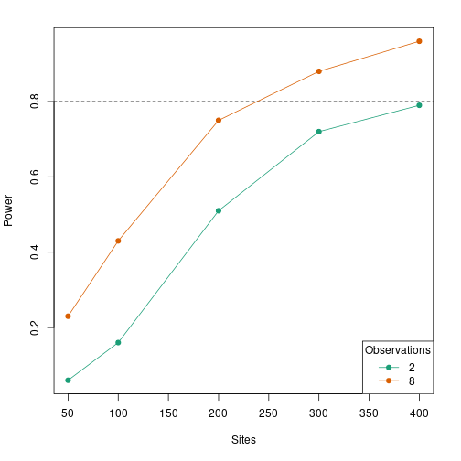

# Hypothesis Testing

For many analyses in `unmarked`, a primary goal is to determine if a certain covariate affects the state or detection process.
For example, we may want to determine if elevation has an effect on probability of site occupancy, or if wind speed has an effect on detection.
We can formulate this idea as set of statistical hypotheses: the null hypothesis ($H_0$) and the alternative hypothesis ($H_a$):

* $H_0$: There is no effect of elevation on occupancy
* $H_a$: Elevation has an effect on occupancy

In order to test these hypotheses, we must collected appropriate data, perhaps by sampling a series of sites at varying elevation for the presence of the species.
We can then fit a model in `unmarked`, specifying in the formula that we are interested in estimating the effect of elevation on occupancy.
For example, here is a simple model fit to the `crossbill` presence-absence dataset included with `unmarked`:


``` r
library(unmarked)
data(crossbill)

umf <- unmarkedFrameOccu(y=crossbill[,11:13], 
                         siteCovs=data.frame(elev=scale(crossbill$ele)))
(mod <- occu(~1~elev, umf))
```

```
## Warning: 7 sites have been discarded because of missing data.
```

```
## 
## Call:
## occu(formula = ~1 ~ elev, data = umf)
## 
## Occupancy:
##             Estimate    SE     z  P(>|z|)
## (Intercept)   -1.223 0.168 -7.27 3.61e-13
## elev           0.594 0.166  3.59 3.35e-04
## 
## Detection:
##  Estimate    SE    z P(>|z|)
##     0.326 0.186 1.75  0.0798
## 
## AIC: 480.8533
```

## Wald tests

In the code{unmarked} output, we obtain an estimate ($\hat{\theta}$) of the regression coefficient associated with elevation (`elev`) along with its standard error.
Our null hypothesis is that elevation has no effect on occupancy, i.e. $\theta_0 = 0$.
With this information, we can conduct a statistical hypothesis test called a Wald test:
$$
\sqrt{W} = \frac{(\hat{\theta} -\theta_0)}{se(\hat{\theta})}
$$

Or simplified:
$$
\sqrt{W} = \frac{(0.5939 - 0)}{0.1656} = 3.59
$$

It turns out that the square root of the Wald statistic, $\sqrt{W}$, follows a standard normal distribution.
Thus, we can calculate the probability that our observed statistic, $\sqrt{W} = 3.59$, occurred by chance assuming that the null hypothesis $\theta = 0$ is true.
In R, for a two-tailed test, this can be calculated as:


``` r
z = sqrt_w = coef(mod)[2] / SE(mod)[2]
2*pnorm(abs(z), lower.tail=FALSE)
```

```
##    psi(elev) 
## 0.0003350055
```

This is the p-value. These values we calculated manually match the results that `unmarked` gave us in the summary output.

## Making a conclusion

Before conducting our study, we should have defined a threshold p-value (the significance level or $\alpha$) below which we reject the null hypothesis.
Traditionally, $\alpha = 0.05$.
Our calculated p-value is less than $\alpha$, so we reject the null hypothesis that elevation has no effect on occupancy.

## Types of error

There are two types of errors that we could be making at this point:

1. Type I error: We reject the null hypothesis when in fact it is true. Type I error is conceptually the same as $\alpha$. If we set $\alpha$ larger, we have a greater chance of Type I error.
2. Type II error: We fail to reject the null hypothesis when in fact it is false. This can occur, for example, if we did not have enough data to detect an effect.

In this vignette, we are most concerned with Type II error.
How do we know we have enough data to detect if a covariate has a certain effect?
To answer this question we can use power analysis.

# Power Analysis in unmarked

## Introduction

Statistical power is defined as 1 - Type II error.
So more power means less chance of false negatives, i.e., less chance of failing to reject the null hypothesis when it is false.
Statistical power depends on three other pieces of information:

1. The effect size: the magnitude of the effect of the covariate. The larger the effect, the more power we have to detect it.
2. The sample size: how many sites or surveys we've done. The more samples, the more power we have.
3. The significance level, $\alpha$. The smaller we make $\alpha$, the less power we have: thus there is a tradeoff between Type I and Type II error.

Of the three factors (2) is the one that makes the most sense for researchers to manipulate in order to increase power.
However, increasing the sample size requires additional effort and money - so how large does it need to be?

For many statistical models, mathematical formulas have been developed so that power can be calculated for any combination of values for factors 1-3 above.
This is not true for most occupancy and abundance models available in `unmarked` (but see @Guillera_2012 for one example with occupancy models).
Thus, `unmarked` uses a simulation-based approach for estimating power under various combinations of values for effect size, sample size, and significance level.
Below, we illustrate this approach for a single-season occupancy model.

## Inputs

We can do power analysis in `unmarked` using the `powerAnalysis` function.
The `powerAnalysis` function requires several arguments.

1. `object`: Information about the study design, which is provided in the form of an `unmarkedFrame`. Different model types have different `unmarkedFrame` types. For example, occupancy models use `unmarkedFrameOccu` objects.
2. `model`: Type of model we are testing. This is provided as the name of the fitting function; in this case `occu` for single-season occupancy. For many model types, there is a one-to-one correspondence between `unmarkedFrame` type and model type; in these cases it is not necessary to also provide the name of the model. However, for single-season occupancy specifically, `unmarkedFrameOccu` objects are used for the `occu`, `occuRN`, and `occuPEN` model types, so we do need to provide the model name.
3. `...`: Other arguments required by the appropriate fitting function to fit the model of interest. In nearly all cases this will include formulas. In the case of `occu`, the only required additional argument is `formula`, which defines the detection and occupancy model structures. See the help file for the fitting function of interest to determine which arguments are required.
4. `effects`: The effect sizes. We'll talk about these more later.
5. `alpha`: The Type I error rate. We'll leave this at the default of 0.05.

### The `unmarkedFrame`

The `unmarkedFrame` is used to define the study design (such as number of sites, number of occasions, distance breaks in a distance sampling analysis, etc.) and covariate data (typically simulated).
Each model type has a specific kind of `unmarkedFrame`; for an occupancy analysis it is `unmarkedFrameOccu`.
The response data (i.e., the y-matrix) can be filled with missing or random values, as they are replaced later via simulation.
We only care about its dimensions.


``` r
set.seed(123)
M <- 400                  # number of sites
J <- 8                    # number of occasions
y <- matrix(NA, M, J)     # blank y matrix
elev <- rnorm(M)          # site covariate

umf <- unmarkedFrameOccu(y = y, siteCovs = data.frame(elev=elev))
head(umf)
```

```
## Data frame representation of unmarkedFrame object.
##    y.1 y.2 y.3 y.4 y.5 y.6 y.7 y.8        elev
## 1   NA  NA  NA  NA  NA  NA  NA  NA -0.56047565
## 2   NA  NA  NA  NA  NA  NA  NA  NA -0.23017749
## 3   NA  NA  NA  NA  NA  NA  NA  NA  1.55870831
## 4   NA  NA  NA  NA  NA  NA  NA  NA  0.07050839
## 5   NA  NA  NA  NA  NA  NA  NA  NA  0.12928774
## 6   NA  NA  NA  NA  NA  NA  NA  NA  1.71506499
## 7   NA  NA  NA  NA  NA  NA  NA  NA  0.46091621
## 8   NA  NA  NA  NA  NA  NA  NA  NA -1.26506123
## 9   NA  NA  NA  NA  NA  NA  NA  NA -0.68685285
## 10  NA  NA  NA  NA  NA  NA  NA  NA -0.44566197
```

We now have an `unmarkedFrame` object which describes our study design, but which does not contain any actual detection/non-detection data.

### The model type

As we discussed earlier, this will be simply `occu`, so that `powerAnalysis` knows we specifically want to test power in a single-season occupancy model.

### Other arguments

After looking at the help page for `occu`, we see that the only other required argument to run an `occu` model is `formula`.
We'll specify an intercept-only formula for detection, and an effect of elevation on occupancy.
In the double-notation formula used by `unmarked`, this results in a formula `~1~elev`.
Other model types will have additional required arguments here, such as multiple separate arguments for formulas, `mixture` to control an abundance distribution, or `keyfun` to specify a distance sampling key function.

### Call `powerAnalysis`

We can now try running `powerAnalysis`, even though we haven't yet discussed effect sizes.


``` r
powerAnalysis(umf, model = occu, formula = ~1~elev)
```

```
## effects should be a named list of vectors, with the following structure
##         (replace 0s with your values):
## 
## $state
## (Intercept)        elev 
##           0           0 
## 
## $det
## (Intercept) 
##           0
```

```
## Error: Specify effects argument as shown above
```

We get an error message indicating that we need to provide effect sizes as a list.
More importantly, we also are given a template for providing those effect sizes, which makes things a lot easier.
The structure of this template corresponds to the model structure we defined with our formulas.
Note that the list has two named components `state` and `det`, corresponding to the two submodels, and each contains a numeric vector of parameter values in a specific order.

### Effect sizes

The effect size list is as crucial input to `powerAnalysis`.
In this list, we need to provide a value for every parameter in the model in order to simulate datasets.
Note that this will include both parameters we specifically want effect sizes for, such as covariate effects, but also other parameters such as intercepts, scale parameters, etc.
All parameter values, even ones we're not specifically interested in calculating power for, will ultimately have some impact on power calculations.
For example, even if we are only interested in the effect size of a covariate on occupancy, the value we choose for the detection intercept will control overall detection probability which will in turn influence power.
So, you should choose all values here carefully based on your study system.

Furthermore, all parameter values in this list need to be on the appropriate inverse link scale.
Remember that for an occupancy model,

$$ \psi_i = \mathrm{ilogit}(\beta_0 + \beta_1 \cdot elev_i) $$

We need to provide values of $\beta_0$ and $\beta_1$ in our effect size list, which are on the inverse logit ($\mathrm{ilogit}$) scale.
So for example, a value of 0 for $\beta_0$ corresponds to an average probability of 0.5:


``` r
plogis(0)
```

```
## [1] 0.5
```

We'll specify values of 0 for both the state and detection intercepts, and a value of -0.4 for the effect of elevation.
The elevation effect is the one we are specifically interested in estimating our power to detect.
We'd choose these values based on our hypotheses, understanding of our study system, etc.
Note that the list elements need to be named just as in the template we saw earlier, and each element is a numeric vector in a specific order.


``` r
ef <- list(state = c(0, -0.4), det = 0)
```

## Run the power analysis

We're now ready to run the analysis, adding our effect size list.


``` r
pa400 <- powerAnalysis(umf, model = occu, formula = ~1~elev, effects = ef)
```

```
## Assumed parameter order for state:
## (Intercept), elev
```

```
## Assumed parameter order for det:
## (Intercept)
```

You'll see a progress bar as each simulation is run.
By default `unmarked` runs 100 simulations, but you can change this with the `nsim` argument.

Take a look at the output:


``` r
pa400
```

```
## Model: test
## Sites: 400
## Primary Periods: 1
## Occasions: 8
## alpha: 0.05
## 
## Power Statistics:
##  Submodel Parameter Effect Power Type S Type M
##     state      elev   -0.4  0.96      0  1.054
```

First we get some information about the study design and Type I error.
After that is a table of power statistics for each parameter of interest.
By default the intercepts are excluded from this table (since they are rarely of interest).
Thus we have a single row in the table for our elevation effect.

We have very high power to detect the effect in this case (0.96).
Also reported are the Type S (sign) and Type M (magnitude) errors (@gelman2014).
The Type S error is the proportion of significant effects which are the wrong sign.
The Type M error is the average absolute value of significant effect sizes, relative to the real effect size.
When your study is underpowered, you will often have high Type S and Type M errors, which indicate you risk getting the direction of the effect wrong, or overestimating the effect size, respectively.
In this case Type S error is close to 0 and Type M error is close to 1, indicating no problems.
We'll talk more about Type M errors in a minute.

## Run the power analysis for a smaller sample size

Usually you'll want to test a few sample sizes to compare power across them.
Let's test a much smaller sample size of only 50 sites.
We can do this quickly by just sub-setting our `unmarkedFrame` to only the first 50 sites; we could also simulate an entirely new one.


``` r
umf50 <- umf[1:50,]
```

Now call `powerAnalysis` again using the new `unmarkedFrame`:


``` r
pa50 <- powerAnalysis(umf50, model = occu, formula = ~1~elev, effects = ef)
pa50
```

```
## Model: test
## Sites: 50
## Primary Periods: 1
## Occasions: 8
## alpha: 0.05
## 
## Power Statistics:
##  Submodel Parameter Effect Power Type S Type M
##     state      elev   -0.4  0.23      0  2.246
```

With a much smaller sample size, we also have much lower power.
Note we also have a Type M error ~2, indicating that any significant effect sizes we do get from a study of this sample size are likely to be overestimates.
We can visualize this using `plot`:


``` r
plot(pa50)
```


Note that the simulation replicates that were significant (red) tended to have much more negative estimated effect sizes than the truth.
If you conducted this study with only 50 sites and found a significant elevation effect, it's likely the estimate you obtain would be much stronger (i.e., larger absolute value) than the truth.
To read more about Type M and Type S errors, see @gelman2014.

## Compare power across several sample sizes

Let's run a few more power analyses at sample sizes between 50 and 400.
Note it would probably better to create new `unmarkedFrame`s for each instead of sub-sampling the same one, but we'll skip this for brevity.


``` r
pa100 <- powerAnalysis(umf[1:100,], model = occu, formula = ~1~elev, effects = ef)
pa200 <- powerAnalysis(umf[1:200,], model = occu, formula = ~1~elev, effects = ef)
pa300 <- powerAnalysis(umf[1:300,], model = occu, formula = ~1~elev, effects = ef)
```

We can combine all our power analyses into one `unmarkedPowerList` object:


``` r
pl <- unmarkedPowerList(pa50, pa100, pa200, pa300, pa400)
```

View a summary:


``` r
pl
```

```
## Model: test 
## Number of sites (M):           50, 100, 200, 300, 400 
## Number of primary periods (T): 1, 1, 1, 1, 1 
## Number of occasions (J):       8, 8, 8, 8, 8 
## alpha:                         0.05 
## 
##     M T J Submodel Parameter Effect Null Power Type S   Type M
## 1  50 1 8    state      elev   -0.4    0  0.23      0 2.246006
## 2 100 1 8    state      elev   -0.4    0  0.43      0 1.613682
## 3 200 1 8    state      elev   -0.4    0  0.75      0 1.205985
## 4 300 1 8    state      elev   -0.4    0  0.88      0 1.089148
## 5 400 1 8    state      elev   -0.4    0  0.96      0 1.054162
```

Plot the power curve:


``` r
plot(pl, power = 0.8)
```



A sample size of 300 would be adequate to get to our target power of 0.8

We could also vary the number of occasions:


``` r
pa50_2 <- powerAnalysis(umf[1:50,1:2], model = occu, formula = ~1~elev, effects = ef)
pa100_2 <- powerAnalysis(umf[1:100,1:2], model = occu, formula = ~1~elev, effects = ef)
pa200_2 <- powerAnalysis(umf[1:200,1:2], model = occu, formula = ~1~elev, effects = ef)
pa300_2 <- powerAnalysis(umf[1:300,1:2], model = occu, formula = ~1~elev, effects = ef)
pa400_2 <- powerAnalysis(umf[,1:2], model = occu, formula = ~1~elev, effects = ef)
```


``` r
pl2 <- unmarkedPowerList(pa50, pa100, pa200, pa300, pa400,
                         pa50_2, pa100_2, pa200_2, pa300_2, pa400_2)
```


``` r
plot(pl2, power = 0.8)
```



As you can see, reducing the number of replicate samples at each site also reduces power, but generally has less of an impact that number of sites.

# Conclusion

Power analysis is an important step in the research process that is often overlooked in studies of animal abundance and occurrence.
Getting an estimate of the sample size required to detect a particular effect can help with efficient data collection and set expectations for what covariate relationships might be possible to detect.
The power analysis tools in `unmarked` should help make this part of the research process quick and easy for researchers as the begin to develop study designs.

# References
